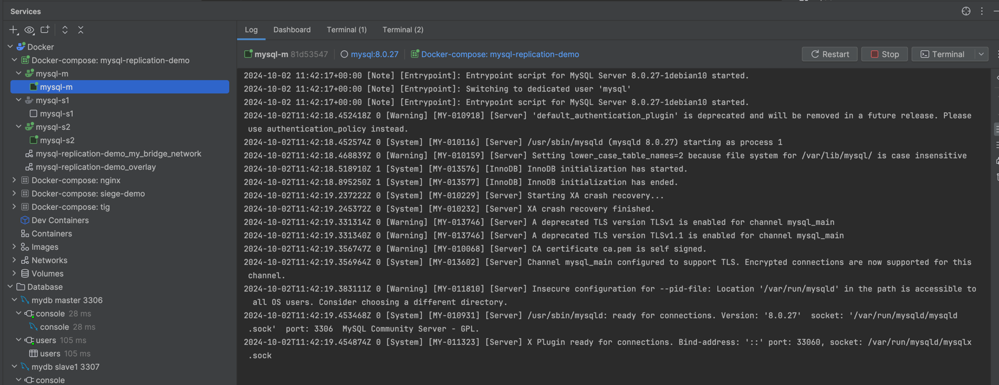

# Set up MySQL Cluster

## Create 3 docker containers: mysql-m, mysql-s1, mysql-s2

```docker
services:
  mysql-m:
    image: mysql:8.0.27
    container_name: mysql-m
    platform: linux/amd64
    environment:
      MYSQL_ROOT_PASSWORD: root
      MYSQL_DATABASE: mydb
      MYSQL_USER: linnyk
      MYSQL_PASSWORD: linnyk
    ports:
      - "3306:3306"
    volumes:
      - ./mysql_data_master:/var/lib/mysql
      - ./mysql_logs_master:/var/log/mysql
      - ./master/mysql.conf.cnf:/etc/mysql/conf.d/mysql.conf.cnf
      - ./init.sql:/docker-entrypoint-initdb.d/init.sql
    networks:
      - my_bridge_network

  mysql-s1:
    image: mysql:8.0.27
    container_name: mysql-s1
    platform: linux/amd64
    depends_on:
      - mysql-m
    environment:
      MYSQL_ROOT_PASSWORD: root
      MYSQL_DATABASE: mydb
      MYSQL_USER: linnyk
      MYSQL_PASSWORD: linnyk
    ports:
      - "3307:3306"
    volumes:
      - ./mysql_data_slave_1:/var/lib/mysql
      - ./mysql_logs_slave_1:/var/log/mysql
      - ./slave_1/mysql.conf.cnf:/etc/mysql/conf.d/mysql.conf.cnf
    networks:
      - my_bridge_network

  mysql-s2:
    image: mysql:8.0.27
    container_name: mysql-s2
    platform: linux/amd64
    depends_on:
      - mysql-m
    environment:
      MYSQL_ROOT_PASSWORD: root
      MYSQL_DATABASE: mydb
      MYSQL_USER: linnyk
      MYSQL_PASSWORD: linnyk
    ports:
      - "3308:3306"
    volumes:
      - ./mysql_data_slave_2:/var/lib/mysql
      - ./mysql_logs_slave_2:/var/log/mysql
      - ./slave_1/mysql.conf.cnf:/etc/mysql/conf.d/mysql.conf.cnf
    networks:
      - my_bridge_network

networks:
  my_bridge_network:
    driver: bridge

```

## Setup master slave replication (Master: mysql-m, Slave: mysql-s1, mysql-s2)

### 1. Start master container

```docker
  mysql-m:
    image: mysql:8.0.27
    container_name: mysql-m
    platform: linux/amd64
    environment:
      MYSQL_ROOT_PASSWORD: root
      MYSQL_DATABASE: mydb
      MYSQL_USER: linnyk
      MYSQL_PASSWORD: linnyk
    ports:
      - "3306:3306"
    volumes:
      - ./mysql_data_master:/var/lib/mysql
      - ./mysql_logs_master:/var/log/mysql
      - ./master/mysql.conf.cnf:/etc/mysql/conf.d/mysql.conf.cnf
      - ./init.sql:/docker-entrypoint-initdb.d/init.sql
    networks:
      - my_bridge_network
```

### 2. Give permissions to replication user

```bash
GRANT REPLICATION SLAVE ON *.* TO 'linnyk'@'%';
FLUSH PRIVILEGES;
```

### 3. Check master status

```bash
SHOW MASTER STATUS
```


### 4. Setup slave 1

```docker
  mysql-s1:
    image: mysql:8.0.27
    container_name: mysql-s1
    platform: linux/amd64
    depends_on:
      - mysql-m
    environment:
      MYSQL_ROOT_PASSWORD: root
      MYSQL_DATABASE: mydb
      MYSQL_USER: linnyk
      MYSQL_PASSWORD: linnyk
    ports:
      - "3307:3307"
    volumes:
      - ./mysql_data_slave_1:/var/lib/mysql
      - ./mysql_logs_slave_1:/var/log/mysql
      - ./slave_1/mysql.conf.cnf:/etc/mysql/conf.d/mysql.conf.cnf
    networks:
      - my_bridge_network
```

### 5. Setup slave 1 replication params

```bash 
CHANGE MASTER TO MASTER_HOST='mysql-m', MASTER_USER='linnyk', MASTER_PASSWORD='linnyk',
MASTER_LOG_FILE = 'mysql-bin.000004', MASTER_LOG_POS = 712;
START SLAVE;
```

### 6. SHOW SLAVE STATUS

| Field                       | Value                                                    |
|-----------------------------|----------------------------------------------------------|
| **Slave_IO_State**          | Waiting for source to send event                         |
| **Master_Host**             | mysql-m                                                  |
| **Master_User**             | linnyk                                                   |
| **Master_Port**             | 3306                                                     |
| **Connect_Retry**           | 60                                                       |
| **Master_Log_File**         | mysql-bin.000004                                         |
| **Read_Master_Log_Pos**     | 712                                                      |
| **Relay_Log_File**          | mysql-relay-bin.000002                                   |
| **Relay_Log_Pos**           | 324                                                      |
| **Relay_Master_Log_File**   | mysql-bin.000004                                         |
| **Slave_IO_Running**        | Yes                                                      |
| **Slave_SQL_Running**       | Yes                                                      |
| **Exec_Master_Log_Pos**     | 712                                                      |
| **Relay_Log_Space**         | 533                                                      |
| **Seconds_Behind_Master**   | 0                                                        |
| **Master_Server_Id**        | 1                                                        |
| **Master_UUID**             | ccad5c25-80ab-11ef-a5f6-0242ac130002                     |
| **Slave_SQL_Running_State** | Replica has read all relay log; waiting for more updates |
| **Master_Retry_Count**      | 86400                                                    |
| **Auto_Position**           | 0                                                        |

### 7. Setup slave 2

```docker
  mysql-s2:
    image: mysql:8.0.27
    container_name: mysql-s2
    platform: linux/amd64
    depends_on:
      - mysql-m
    environment:
      MYSQL_ROOT_PASSWORD: root
      MYSQL_DATABASE: mydb
      MYSQL_USER: linnyk
      MYSQL_PASSWORD: linnyk
    ports:
      - "3308:3308"
    volumes:
      - ./mysql_data_slave_2:/var/lib/mysql
      - ./mysql_logs_slave_2:/var/log/mysql
      - ./slave_1/mysql.conf.cnf:/etc/mysql/conf.d/mysql.conf.cnf
    networks:
      - my_bridge_network
```

### 8. Setup slave 2 replication params

```bash 
CHANGE MASTER TO MASTER_HOST='mysql-m', MASTER_USER='linnyk', MASTER_PASSWORD='linnyk',
MASTER_LOG_FILE = 'mysql-bin.000004', MASTER_LOG_POS = 712;
START SLAVE;
```

### 9. SHOW SLAVE STATUS

| Field                       | Value                                                    |
|-----------------------------|----------------------------------------------------------|
| **Slave_IO_State**          | Waiting for source to send event                         |
| **Master_Host**             | mysql-m                                                  |
| **Master_User**             | linnyk                                                   |
| **Master_Port**             | 3306                                                     |
| **Connect_Retry**           | 60                                                       |
| **Master_Log_File**         | mysql-bin.000004                                         |
| **Read_Master_Log_Pos**     | 712                                                      |
| **Relay_Log_File**          | mysql-relay-bin.000002                                   |
| **Relay_Log_Pos**           | 324                                                      |
| **Relay_Master_Log_File**   | mysql-bin.000004                                         |
| **Slave_IO_Running**        | Yes                                                      |
| **Slave_SQL_Running**       | Yes                                                      |
| **Exec_Master_Log_Pos**     | 712                                                      |
| **Relay_Log_Space**         | 533                                                      |
| **Seconds_Behind_Master**   | 0                                                        |
| **Master_Server_Id**        | 1                                                        |
| **Master_UUID**             | ccad5c25-80ab-11ef-a5f6-0242ac130002                     |
| **Slave_SQL_Running_State** | Replica has read all relay log; waiting for more updates |
| **Master_Retry_Count**      | 86400                                                    |
| **Auto_Position**           | 0                                                        |


## Write script that will frequently write data to database

### [src/main/java/demo/demo/UserService.java](src/main/java/demo/demo/UserService.java)

## Ensure, that replication is working

### SHOW SLAVE STATUS #1

| Field                       | Value                                                    |
|-----------------------------|----------------------------------------------------------|
| **Slave_IO_State**          | Waiting for source to send event                         |
| **Master_Host**             | mysql-m                                                  |
| **Master_User**             | linnyk                                                   |
| **Master_Port**             | 3306                                                     |
| **Connect_Retry**           | 60                                                       |
| **Master_Log_File**         | mysql-bin.000005                                         |
| **Read_Master_Log_Pos**     | 13483218                                                 |
| **Relay_Log_File**          | mysql-relay-bin.000005                                   |
| **Relay_Log_Pos**           | 13435785                                                 |
| **Relay_Master_Log_File**   | mysql-bin.000005                                         |
| **Slave_IO_Running**        | Yes                                                      |
| **Slave_SQL_Running**       | Yes                                                      |
| **Exec_Master_Log_Pos**     | 13435570                                                 |
| **Relay_Log_Space**         | 13483810                                                 |
| **Seconds_Behind_Master**   | 0                                                        |
| **Master_Server_Id**        | 1                                                        |
| **Master_UUID**             | ccad5c25-80ab-11ef-a5f6-0242ac130002                     |
| **Slave_SQL_Running_State** | Replica has read all relay log; waiting for more updates |
| **Master_Retry_Count**      | 86400                                                    |
| **Auto_Position**           | 0                                                        |

### SHOW SLAVE STATUS #2

| Field                       | Value                                |
|-----------------------------|--------------------------------------|
| **Slave_IO_State**          | Waiting for source to send event     |
| **Master_Host**             | mysql-m                              |
| **Master_User**             | linnyk                               |
| **Master_Port**             | 3306                                 |
| **Connect_Retry**           | 60                                   |
| **Master_Log_File**         | mysql-bin.000005                     |
| **Read_Master_Log_Pos**     | 13626801                             |
| **Relay_Log_File**          | mysql-relay-bin.000005               |
| **Relay_Log_Pos**           | 13606255                             |
| **Relay_Master_Log_File**   | mysql-bin.000005                     |
| **Slave_IO_Running**        | Yes                                  |
| **Slave_SQL_Running**       | Yes                                  |
| **Exec_Master_Log_Pos**     | 13606040                             |
| **Relay_Log_Space**         | 13627393                             |
| **Seconds_Behind_Master**   | 1                                    |
| **Master_Server_Id**        | 1                                    |
| **Master_UUID**             | ccad5c25-80ab-11ef-a5f6-0242ac130002 |
| **Slave_SQL_Running_State** | Reading event from the relay log     |
| **Master_Retry_Count**      | 86400                                |
| **Auto_Position**           | 0                                    |

### SHOW SLAVE STATUS #3

| Field                       | Value                                                    |
|-----------------------------|----------------------------------------------------------|
| **Slave_IO_State**          | Queueing source event to the relay log                   |
| **Master_Host**             | mysql-m                                                  |
| **Master_User**             | linnyk                                                   |
| **Master_Port**             | 3306                                                     |
| **Connect_Retry**           | 60                                                       |
| **Master_Log_File**         | mysql-bin.000005                                         |
| **Read_Master_Log_Pos**     | 13771920                                                 |
| **Relay_Log_File**          | mysql-relay-bin.000005                                   |
| **Relay_Log_Pos**           | 13718345                                                 |
| **Relay_Master_Log_File**   | mysql-bin.000005                                         |
| **Slave_IO_Running**        | Yes                                                      |
| **Slave_SQL_Running**       | Yes                                                      |
| **Exec_Master_Log_Pos**     | 13718130                                                 |
| **Relay_Log_Space**         | 13772512                                                 |
| **Seconds_Behind_Master**   | 0                                                        |
| **Master_Server_Id**        | 1                                                        |
| **Master_UUID**             | ccad5c25-80ab-11ef-a5f6-0242ac130002                     |
| **Slave_SQL_Running_State** | Replica has read all relay log; waiting for more updates |
| **Master_Retry_Count**      | 86400                                                    |
| **Auto_Position**           | 0                                                        |

### SHOW SLAVE STATUS #4

| Field                       | Value                                                    |
|-----------------------------|----------------------------------------------------------|
| **Slave_IO_State**          | Waiting for source to send event                         |
| **Master_Host**             | mysql-m                                                  |
| **Master_User**             | linnyk                                                   |
| **Master_Port**             | 3306                                                     |
| **Connect_Retry**           | 60                                                       |
| **Master_Log_File**         | mysql-bin.000005                                         |
| **Read_Master_Log_Pos**     | 13915510                                                 |
| **Relay_Log_File**          | mysql-relay-bin.000005                                   |
| **Relay_Log_Pos**           | 13886723                                                 |
| **Relay_Master_Log_File**   | mysql-bin.000005                                         |
| **Slave_IO_Running**        | Yes                                                      |
| **Slave_SQL_Running**       | Yes                                                      |
| **Exec_Master_Log_Pos**     | 13886508                                                 |
| **Relay_Log_Space**         | 13916102                                                 |
| **Seconds_Behind_Master**   | 0                                                        |
| **Master_Server_Id**        | 1                                                        |
| **Master_UUID**             | ccad5c25-80ab-11ef-a5f6-0242ac130002                     |
| **Slave_SQL_Running_State** | Replica has read all relay log; waiting for more updates |
| **Master_Retry_Count**      | 86400                                                    |
| **Auto_Position**           | 0                                                        |

## Try to turn off mysql-s1 (stop slave),

### Stoped mysql-s1 but nothing happened with master and slave 2



## Try to remove a column in  database on slave node (try to delete last column and column from the middle)

```mysql
alter table users
    drop column password;
```

### Received errors on master node

```bash
2024-10-02T12:03:46.197341Z 9 [ERROR] [MY-013146] [Repl] Slave SQL for channel '': Worker 1 failed executing transaction 'ANONYMOUS' at master log mysql-bin.000005, end_log_pos 24224803; Column 2 of table 'mydb.users' cannot be converted from type 'varchar(200(bytes))' to type 'date', Error_code: MY-013146
2024-10-02T12:03:46.201398968Z 2024-10-02T12:03:46.201194Z 6 [ERROR] [MY-010586] [Repl] Error running query, slave SQL thread aborted. Fix the problem, and restart the slave SQL thread with "SLAVE START". We stopped at log 'mysql-bin.000005' position 24177459
```

## Write conclusion

Even though I thought it's easy to setup the replication with three nodes, I faced with troubles of user permission
configuration and replication errors. But after some time I managed to setup the replication and test it. I also tried
to stop one of the slave nodes and remove a column from the table on the slave node. It caused errors on the master
node.